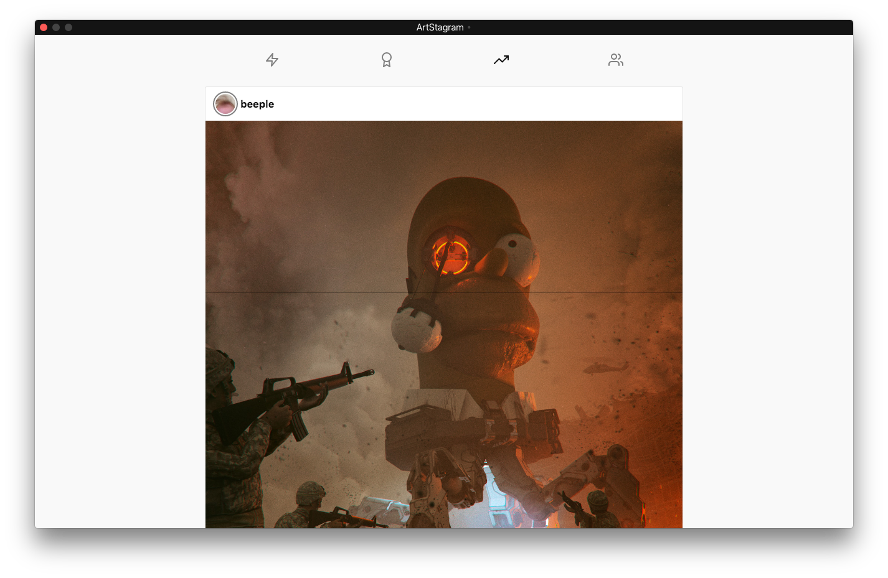
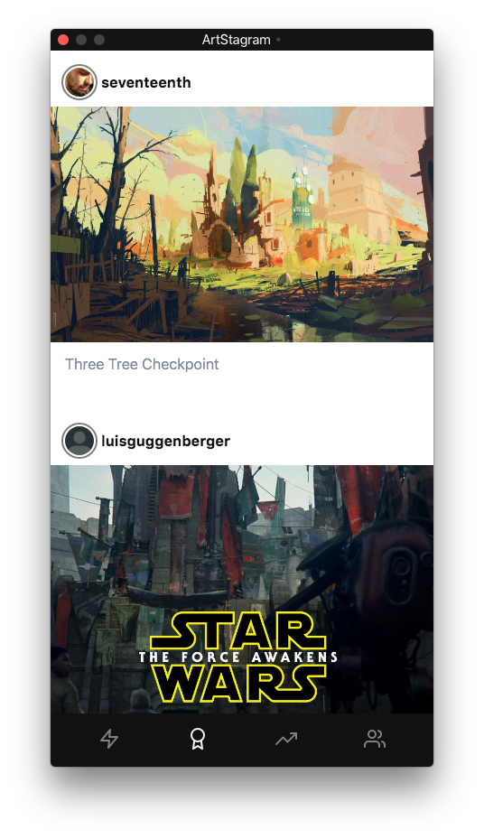
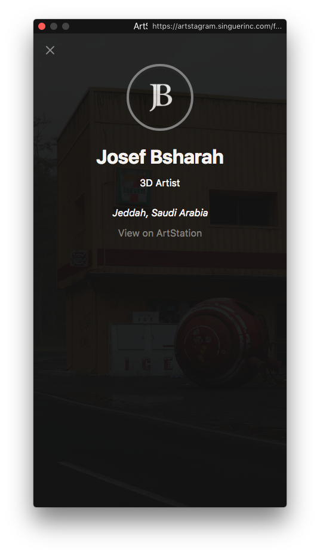

# ArtStagram

Unofficial ArtStation client with an Instagram inspired feed.

[https://artstagram.singuerinc.com/](https://artstagram.singuerinc.com/)

## Features

- Single page application
- Service worker (cache / offline support)

## Screenshots

### Feed (desktop)

### Feed (mobile)

### Artist profile

## Good stuff that make my life easier

- [axios](https://github.com/axios/axios)
- [React](https://reactjs.org/)
- [React Router](https://github.com/ReactTraining/react-router)
- [react-waypoint](https://github.com/brigade/react-waypoint)
- [nprogress](https://github.com/rstacruz/nprogress)
- Static hosting and Amazon Lambda function from [Netlify](https://www.netlify.com/)
